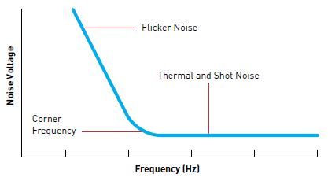
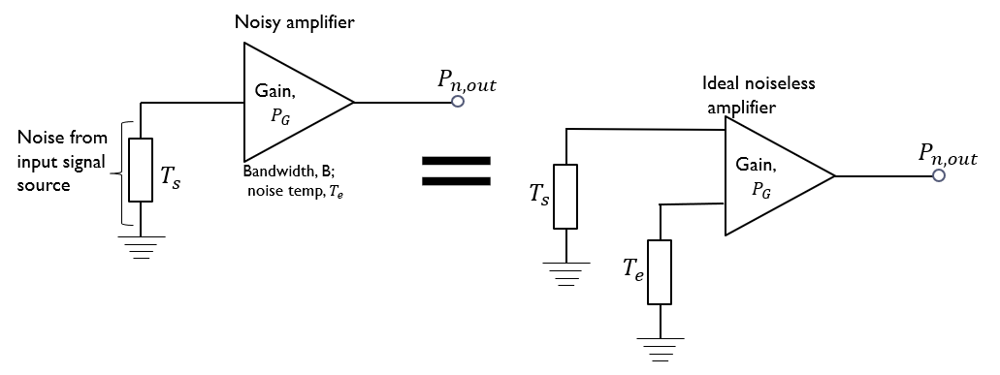

# Sensor Networks and Data Analysis - Communications

## Noise and Bandwidth

> Noise: undesirable signal perturbation, always present in communication systems. Noise is random and non-deterministic, so probabilistic (Gaussian random variable), and can be internal or external to system

### Internal Noise

Generated by components within the system, such as: resistors and active solid state devices. Internal noise is a result of the random motion of charge carriers in electronic components

Types of internal noise:

- Thermal (Johnson) noise: random motion of free electrons in a conductor or semiconductor due to thermal agitation

- Shot noise: random arrival of discrete carriers in devices like: thermionic tubes or semiconductor junction devices

- Flicker ($ \frac{1}{f} $) noise: produced in semiconductors, with strength 
inversely proportional to frequency

Noise Voltage ($ nV \sqrt{Hz} $) vs Frequency ($ Hz $) usually with log scale graph:

### External Noise

Results from sources outside of communication system such as atmospheric (thunderstorm), man-made and extra-terrestrial sources (sun...). 

#### Atmospheric Noise

- Impulsive - large amplitude for short duration bursts
- Strength inversely proportional to frequency - affects commercial AM radio (540 kHz - 1.6MHz) more than TV and FM (>50MHz)

#### Man-made Noise

Sources include: 

- High voltage power-line corona discharge
- Electric motor commutator generated noise
- Auto and aero ignition noise
- Switching gears noise
- Other radio-frequency transmitters - radio frequency interference (RFI)

#### Extra-terrestrial Noise

Sources include:

- Sun
- Stars

### Noise Calculations

Noise power for thermal/Johnson/white noise is:

$ P_n = k T B \quad (B = \Delta f) $

- $ k $ - Boltzmann's constant:  $ 1.38 \times 10^-23 $ J/K
- $ T $ - Temperature in Kelvin(K): $ K = \degree C + 273 $
- B = $ \Delta f $ - Bandwidth of system

#### Resistor Noise

Take a voltage source $ e_{n} $ with resistance $ R $, in series with a resistor $ R_{l} $. By the maximum power theorem, the maximum noise power voltage occurs when $ R = R_{l} $. Equating the noise power equation to the power dissipated in the resistor, the RMS noise voltage in a resistor $ e_n $ is:

$
\begin{aligned}
    P_{n} = k T \Delta f = \frac{(e_{n}/2)^2}{R} \implies e_n = \sqrt{4kT\Delta f R}
\end{aligned}
$

#### Decibel definition
A Bel is defined as:  

$
\begin{aligned}
Bel = \log_{10} \left(\frac{P_{out}}{P_{in}} \right) 
\end{aligned}
$

Thus a decibel is: 

$
\begin{aligned}
dB = 10 \log_{10} \left(\frac{P_{out}}{P_{in}} \right) = 20 log_{10} \left(\frac{V_{out}}{V_{in}} \right) 
\end{aligned}
$

#### Amplifier Noise Figure
Noise ratio NR (or factor, F):

$
\begin{aligned}
NR = \frac{(S/N)_{in}}{(S/N)_{out}}
\end{aligned}
$

- $(S/N)_{in} $ is the signal power to noise power ratio at the input to an amplifier (or other device)
- $(S/N)_{out} $ signal to noise power ratio at the output

The Noise Figure, NF (in dB):

$
\begin{aligned}
NF = 10 \log_{10}(NR) \quad (dB)
\end{aligned}
$

In a noiseless system, NR = 1, NF = 0 dB

#### Effective Noise Temperature

Measure of system noise as referred to the input. For system with power gain, $ P_{G} $, the effective noise temperature (in Kelvin) is:

$
\begin{aligned}
T_{e} = \frac{P_{n,int}}{P_{G} kB}
\end{aligned}
$

$ T_e $ is chosen to make the noise at the output of a noise free network equal to the noise at the output of the noisy network:

The noise at the output is still:

$
\begin{aligned}
P_{n,out} = (kBT_{s} + kBT_{e})P_{G}
\end{aligned}
$

Thus, at room temperature the input noise power $ N_{in} $, and output noise power $ N_{out} $ are:

$
\begin{aligned}
N_{in} = kBT_{0} \quad N_{out} = (kBT_{0} + kBT_{e})P_{G}
\end{aligned}
$

The signal output power $S_{out} $ is related to the signal input power:

$
\begin{aligned}
S_{out} = P_{G} S_{in}
\end{aligned}
$

Giving ratios:

$
\begin{aligned}
\frac{S_{in}}{N_{in}} = \frac{S_{in}}{kBT_{0}}
\end{aligned}
$

$
\begin{aligned}
\frac{S_{out}}{N_{out}} = \frac{P_{G} S_{in}}{(kBT_{0} + kBT_{e})P_{G}}
\end{aligned}
$

The noise ratio NR is thus related to the effective noise temperature $ T_e $ as:

$
\begin{aligned}
NR = F = \frac{(S/N)_{in}}{(S/N)_{out}} = \frac{T_{0} + T_{e}}{T_{0}} = 1 + \frac{T_{e}}{T_{0}} \\ \\ \implies T_{e} = T_{0}(F - 1)
\end{aligned}
$

## 2 Cascaded Amplifiers Proof

$
\begin{aligned}
S_{out} = G_{sys} S_{in}
\end{aligned}
$

$
\begin{aligned}
NR_{sys} = F_{sys} = \frac{(S/N)_{in}}{(S/N)_{out}} = \frac{S_{in} N_{out}}{S_{out}N_{in}} = \frac{S_{in}N_{out}}{G_{sys}S_{in}N_{in}} = \frac{N_{out}}{G_{sys}N_{in}}
\end{aligned}
$

Each amplifier adds noise, as per $ N_{in} $:

$
\begin{aligned}
N_{in} = N_{s}(F - 1)
\end{aligned}
$

Thus, the noise at the output of the second amplifier is:

$
\begin{aligned}
N_{out} = G_{2}(N_{in2} + N_{s}(F_{2} - 1))
\end{aligned}
$

The noise at the input to the second amplifier $N_{in2}$ is:

$
\begin{aligned}
N_{in2} = G_{1}(N_{s} + N_{s}(F_{1} - 1)) = G_{1}N_{s}F_{1}
\end{aligned}
$

Substituting $N_{in2}$ back into $ N_{out} $:

$
\begin{aligned}
N_{out} = G_{2}(G_{1}N_{s}F_{1} + N_{s}(F_{2} - 1)) = G_{2}N_{s}(G_{1}F_{1} + (F_{2} - 1))
\end{aligned}
$

Substituting $N_{out}$ into the system noise figure $ F_{sys} $ equation:

$
\begin{aligned}
F_{sys} = \frac{G_{2}N_{s}(G_{1}F_{1} + (F_{2} - 1))}{G_{1}G_{2} N_{s}} = \frac{G_{1}F_{1} + (F_{2} - 1)}{G_{1}} = F_{1} + \frac{F_{2} - 1}{G_{1}}
\end{aligned}
$

## Cascaded System
Using the result for [2 cascaded amplifiers](#2-cascaded-amplifiers-proof) above. One places another cascading amplifier in front of the previous amplifiers. Renaming the amplifiers to accommodate this change $ F_{n} := F_{n+1} $. By induction the system noise figure is:

$
\begin{aligned}
F_{sys} = F_{1} + \frac{(F_{2} + \frac{F_{3} - 1}{G_{2}}) - 1}{G_{1}} = F_{1} + \frac{F_{2} - 1}{G_{1}} + \frac{F_{3} - 1}{G_{1}G_{2}} + ...
\end{aligned}
$

## Modulation

TODO: Complete intro

Analogue modulation can be split into 2 main categories: Amplitude (linear) modulation and Angle (exponential) modulation. Angle modulation is further divided into Frequency and Phase modulation, however, these are somewhat similar to each other.

## Analogue - Linear (Amplitude) Modulation

For a sinusoidal carrier, a modulated carrier can generally be represented as:

$ x_{c}(t) = A(t)cos(2 \pi f_{c} t + \phi(t)) $

Linear modulation is when the amplitude $ A(t) $ is linearly related to the modulating signal.

Conventional AM requires transmitting the carrier along with the modulated signal. A  carrier signal $ c(t) $ , with higher frequency $ f_{c} $ (baseband) than the message frequency, is used to modulate and transmit the signal. $ c(t) $ has form:

$
\begin{aligned}
c(t) = A_{c}cos(2 \pi f_{c} t)
\end{aligned}
$

The carrier signal is amplitude modulated by multiplying its unweighted co-sinusoidal term $ cos(2 \pi f_{c} t) $ by the message signal. This produces the amplitude modulated carrier signal: $ m(t)cos(2 \pi f_{c} t) $. After adding this modulated signal to that of the carrier we get the AM signal $x_{AM}(t) $ in the required form, ready for transmission:

$
\begin{aligned}
x_{AM}(t) = A_{c}cos(2 \pi f_{c} t) + m(t)cos(2 \pi f_{c} t) = [A_{c} + m(t)]cos(2 \pi f_{c} t)
\end{aligned}
$

Intuitively this equation makes sense and all the above steps can be skipped in the derivation.

The envelope of the AM signal $ x_{AM}(t) $ is the message signal $ m(t) $. 
Thus, the equations for the envelope (essentially amplitude as function of time) of the AM signal for the top part of the envelope $ E_{t}(t) $ and the bottom part of the envelope $ E_{b}(t) $ respectively are:

$
\begin{aligned}
E_{t}(t) = A_{c} + m(t) \qquad E_{b}(t) = - E_{t}(t)
\end{aligned}
$

In order for the AM signal to be demodulated using coherent detection, and thus contain all the information about the message, the envelopes must not overlap. This is achieved by the condition:

$
\begin{aligned}
(A_{c} + m(t)) \ge 0 \qquad \forall t
\end{aligned}
$

As this analysis applies not only to single tone message signals, we define $m_{p}$ be the peak amplitude of $ m(t) $:

$
\begin{aligned}
m_{p} = |min[m(t)]|
\end{aligned}
$

Thus, the condition for envelope detection simplifies to:

$
\begin{aligned}
(A_{c} + m(t)) \ge 0 \implies A_{c} - m_{p} \ge 0 \implies A_{c} \ge m_{p}
\end{aligned}
$

We define the AM modulation index (or depth) $ \mu $ as the ratio of $ m_{p} $ to $ A_{c} $:

$
\begin{aligned}
\mu = \frac{m_{p}}{A_{c}}
\end{aligned}
$

As $ A_{c}, m_{p}  > 0 $ the condition for envelope detection is simply:

$
\begin{aligned}
A_{c} \ge m_{p} > 0 \implies 1 \ge \frac{m_{p}}{A_{c}} = \mu \implies 0 \le \mu \le 1 
\end{aligned}
$

### Single Tone Message Signal
A single tone message $ m(t) $ is of the form:

$
\begin{aligned}
m(t) = A_{m}cos(2 \pi f_{m} t)
\end{aligned}
$

Substituting into the formula for AM signal: 

$
\begin{aligned}
x_{AM}(t) = [A_{c} + A_{m}cos(2 \pi f_{m} t)]cos(2 \pi f_{c} t)
\end{aligned}
$

Or equivalently:

$
\begin{aligned}
x_{AM}(t) = [A_{c} + A_{c} \frac{A_m}{A_c} cos(2 \pi f_{m} t)]cos(2 \pi f_{c} t) =  A_c[1 + \mu cos(2 \pi f_{m} t)]cos(2 \pi f_{c} t)
\end{aligned}
$

If we define the normalized message signal $ m_n(t) $, with unit amplitude, as:

$
\begin{aligned}
m_{n}(t) = \frac{1}{m_{p}}[m(t)]
\end{aligned}
$

Then the AM signal can be written as:

$
\begin{aligned}
x_{AM}(t) A_c[1 + \mu m_{n}(t)]cos(2 \pi f_{c} t)
\end{aligned}
$

The above equation also applies to [multi-tone signals](#multi-tone-message-signal).

#### AM signal - Frequency contents

We wish to find the frequencies occupied by the AM signal. Multiplying out the single tone AM signal equation:

$
\begin{aligned}
x_{AM}(t) =  A_c[cos(2 \pi f_{c} t) + \mu cos(2 \pi f_{m} t)cos(2 \pi f_{c}t)]
\end{aligned}
$

Recall the trigonometric formula:

$
\begin{aligned}
cos(A)cos(B) = \frac{1}{2}cos(A-B) + \frac{1}{2}cos(A+B)
\end{aligned}
$

Applying the trigonometric formula to the AM signal:

$
\begin{aligned}
x_{AM}(t) =  A_c[cos(2 \pi f_{c} t) + \frac{\mu}{2}cos(2 \pi (f_{c} - f_m) t) + \frac{\mu}{2}cos(2 \pi (f_{c} + f_{m})t)]
\end{aligned}
$

The AM signal occupies the carrier frequency $ f_{c} $, lower sideband $ f_c - f_m $ and higher sideband $ f_c + f_m $

#### Power and Efficiency

TODO: Fill me in

### Multi-tone Message Signal
A multi-tone message $ m(t) $ is of the form:

$
\begin{aligned}
m(t) = A_{1}cos(2 \pi f_{1} t) + A_{2}cos(2 \pi f_{2} t)
\end{aligned}
$

Substituting into the general AM formula:

$
\begin{aligned}
x_{AM}(t) = [A_{c} + m(t)]cos(2 \pi f_{c} t) = [A_{c} + A_{1}cos(2 \pi f_{1} t) + A_{2}cos(2 \pi f_{2} t)]cos(2 \pi f_{c} t)
\end{aligned}
$

As before, we define the modulation indices as:

$
\begin{aligned}
\mu_{i} = \frac{A_{i}}{A_{c}}
\end{aligned}
$

We wish to show that:

$
\begin{aligned}
\mu = \mu_1 + \mu_2 = \frac{m_{p}}{A_{c}} = \frac{A_m}{A_c}
\end{aligned}
$

As the message signal $ m(t) $ is a sum of cosines, the maximum of the message signal occurs at $ t = 0 $, and has amplitude $ m_{p} = A_{m} $:

$ m_{p} = A_m = A_1 + A_2 $

We substitute the modulation indices:

$
\begin{aligned}
x_{AM}(t) = A_{c}[1 + \mu_{1}cos(2 \pi f_{1} t) + \mu_{2}cos(2 \pi f_{2} t)]cos(2 \pi f_{c} t)
\end{aligned}
$

By the definition of the modulation indices, this is clearly equivalent to:

$
\begin{aligned}
x_{AM}(t) = A_{c}[1 + \frac{1}{A_{c}} m(t))]cos(2 \pi f_{c} t)
\end{aligned}
$

From the rearrangement of the formula for the modulation index $ \mu $, this can equivalently be written as:

$
\begin{aligned}
x_{AM}(t) = A_{c}[1 + \frac{\mu}{A_m} m(t))]cos(2 \pi f_{c} t) = A_{c}[1 + \frac{\mu}{m_p} m(t))]cos(2 \pi f_{c} t)
\end{aligned}
$

Recalling the normalized message signal equation $ m_{n}(t) $:

$
\begin{aligned}
m_{n}(t) = \frac{1}{m_{p}}[m(t)]
\end{aligned}
$

Thus, clearly the general equation for the AM signal holds:

$
\begin{aligned}
x_{AM}(t) = A_{c}[1 + \mu m_n(t)]cos(2 \pi f_{c} t)
\end{aligned}
$

### Implementation 

TODO: circuit...

